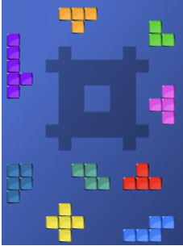

### Blocks Game:  
One of the puzzle games played by only one player; It consists of a random grid, and different pieces of blocks. The goal is to fill the grid with the blocks.  
  
  
#### Game's elements:  
* An empty random grid.  
* several pieces of blocks  
  
#### Game's rules:  
* Every block is placed seperately.  
* Whenever the cell is filled with block, it cannot be replaced with another one (or a part of it) unless you remove the first block.  
* At the end of the game the grid must be filled.  
* Every block must be entirely inside the gird.  
  
#### Requirements:  
We want to program this game so the user may play with its own way of playing.  
Firstly, decide the most convenient structure, and logic. __Do separate UI and game logic__.  
  
#### Notes:  
* Your program should be able to solve any grid, not just the provided one. __The grids will be provided through JSON file (see the example below)__.  
* The code must be professional (not just working).  
  
#### Example:  
```
{
    "field": {
      "width": 8,
      "height": 8,
      "shape": [
        [2,0,2,2,2,2,0,2],
        [0,0,0,0,0,0,0,0],
        [2,0,0,0,0,0,0,2],
        [2,0,0,2,2,0,0,2],
        [2,0,0,2,2,0,0,2],
        [2,0,0,0,0,0,0,2],
        [0,0,0,0,0,0,0,0],
        [2,0,2,2,2,2,0,2]
      ]
    },
    "pieces": [
      {
        "blocks": [
          [0,0],[0,1],[1,1]
        ]
      },
      {
        "blocks":[
            [0,0],[1,0],[2,0],[1,1]
        ]
      },
      {
        "blocks":[
            [0,0],[0,1],[0,2],[0,3],[0,4],[1,3]
        ]
      },
      {
        "blocks":[
            [0,0],[0,1],[0,2],[-1,1]
        ]
      },
      {
        "blocks":[
            [0,0],[0,1],[0,2],[1,1],[-1,1]
        ]
      },
      {
        "blocks":[
            [0,0],[0,1],[1,1],[-1,1]
        ]
      },
      {
        "blocks":[
            [0,0],[0,1],[0,2],[1,0],[1,1]
        ]
      },
      {
        "blocks":[
            [0,0],[1,0],[1,1],[2,1]
        ]
      },
      {
        "blocks":[
            [0,0],[1,0],[2,0],[2,-1],[3,-1]
        ]
      }
      
    ]
  }
  
```